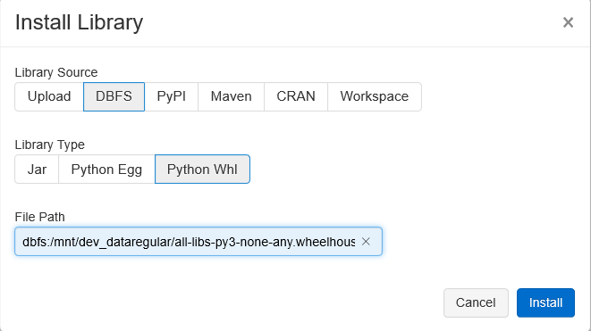

# Wheely

Wheely creates one zip file (aka wheelhouse) containing all pre-downloaded project dependencies/wheels.

## 1. Build docker image

```bash
$ cd docker
$ docker build -t datasentics/wheely .
```

## 2. Build the wheelhouse .zip package

Pass your `requirements.txt` file to the following command to have your `all.wheehouse.zip` file generated into given `/path/to/output-directory` dir on your computer.

```bash
$ cat /path/to/requirements.txt | docker run -i --rm -v /path/to/output-directory:/output datasentics/wheely
```

## 3. Upload the wheelhouse to the DBFS

Upload the wheelhouse to some (sub)folder in `dbfs:/mnt` using Databricks CLI or Azure Blob Storage/AWS S3 GUI. 

## 4. Install the wheelhouse Databricks cluster



Either **install the library manually on your cluster** (*Libraries -> Install Library -> DBFS -> Python Whl*) or use `dbutils.library.install()` in your notebook.
